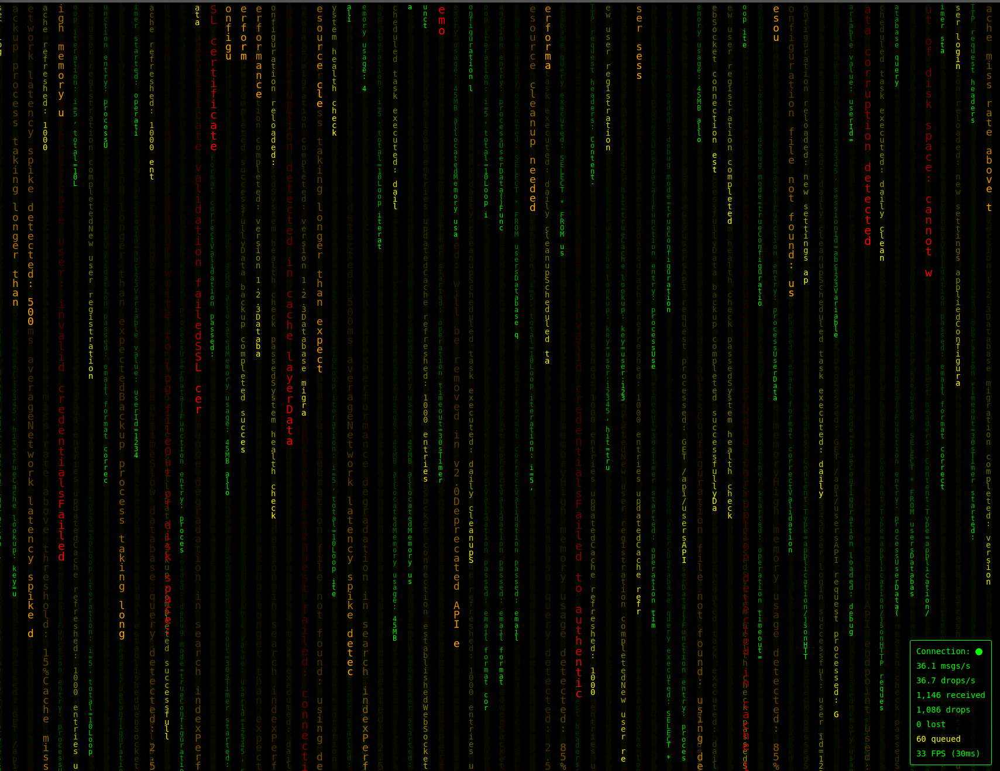

# BBR Log Visualizer

A real-time log visualization server with a Matrix-style rain effect. This application receives log entries via HTTP POST requests and broadcasts them to connected WebSocket clients for real-time visualization.



## Features

- **Real-time Log Streaming**: WebSocket-based real-time log broadcasting
- **Matrix-style Visualization**: Animated log entries with falling rain effect, color-coded by log level
- **RESTful API**: Simple HTTP POST endpoint for log ingestion
- **Log Level Validation**: Supports standard log levels (emergency, alert, critical, error, warning, notice, info, debug)
- **Color-coded Display**: Log entries are color-coded by severity level (errors in red, warnings in yellow, etc.)
- **Live Statistics**: Real-time server statistics display (debug mode only)
- **Flexible Logging**: Production logging to file or debug console output
- **Docker Support**: Containerized deployment ready

## Quick Start

### Using Docker (Recommended)

1. **Build the Docker image:**
   ```bash
   docker build -t bbr-log-server .
   ```

2. **Run the container in detached mode:**
   ```bash
   # Production mode (runs in background)
   docker run -d --name bbr-log-server -p 2069:2069 bbr-log-server
   
   # Debug mode (runs in background with live stats)
   docker run -d --name bbr-log-server -p 2069:2069 -e DEBUG=true bbr-log-server
   
   # Using custom port
   docker run -d --name bbr-log-server -p 8080:8080 -e PORT=8080 bbr-log-server
   ```

3. **View logs:**
   ```bash
   # View real-time logs
   docker logs -f bbr-log-server
   
   # View last 100 lines
   docker logs --tail 100 bbr-log-server
   
   # Stop the container
   docker stop bbr-log-server
   
   # Remove the container
   docker rm bbr-log-server
   ```

4. **Access the application:**
   - Open your browser to `http://your-domain.com` (no port needed when using nginx proxy)
   - The web interface will display real-time logs with Matrix-style animation

### Manual Installation

1. **Install dependencies:**
   ```bash
   npm install
   ```

2. **Start the server:**
   ```bash
   # Production mode (logs to server.log file)
   npm start
   
   # Debug mode (outputs to console with live stats)
   DEBUG=true npm start
   
   # Using custom port
   PORT=8080 npm start
   
   # Debug mode with custom port
   DEBUG=true PORT=8080 npm start
   ```

3. **Access the application:**
   - **Local development**: Open your browser to `http://localhost:2069`
   - **Production with nginx**: Open your browser to `http://your-domain.com` (no port needed)

## API Usage

### Sending Log Entries

Send log entries to the server using HTTP POST requests:

```bash
# For local development
curl -X POST http://localhost:2069/logs \
  -H "Content-Type: application/json" \
  -d '{
    "message": "Application started successfully",
    "level": "info",
    "timestamp": "2024-01-15T10:30:00Z",
    "source": "main.js"
  }'

# For production with nginx proxy
curl -X POST http://your-domain.com/logs \
  -H "Content-Type: application/json" \
  -d '{
    "message": "Application started successfully",
    "level": "info",
    "timestamp": "2024-01-15T10:30:00Z",
    "source": "main.js"
  }'
```

### Required Fields

- `message` (string): The log message content
- `level` (string): Log level (emergency, alert, critical, error, warning, notice, info, debug)


### Example Log Entry

```json
{
  "message": "Database connection established",
  "level": "info"
}
```

## Configuration

### Environment Variables

- `PORT`: Server port (default: 2069)
- `DEBUG`: Enable debug mode (set to `true` or `1` to enable console output and live stats)

### Debug Mode vs Production Mode

The server operates in two distinct modes based on the `DEBUG` environment variable:

**Production Mode (default):**
- All server output is logged to `server.log` file
- No console output except for errors
- No live statistics display
- Optimized for production deployment

**Debug Mode (`DEBUG=true` or `DEBUG=1`):**
- All output appears in the console
- Live statistics display showing requests/sec and messages/sec
- Real-time server monitoring
- Ideal for development and troubleshooting

**Note:** Statistics are never logged to file - they only appear in the console when in debug mode.

### Domain and DNS Configuration

Before deploying, you'll need to set up your domain and DNS:

1. **Purchase a domain** from a domain registrar (e.g., Namecheap, GoDaddy, Cloudflare)
2. **Point your domain** to your server's IP address:
   - Create an A record: `your-domain.com` → `YOUR_SERVER_IP`
   - Optionally create a CNAME for www: `www.your-domain.com` → `your-domain.com`
3. **Update the configuration** below with your actual domain name

### Nginx Setup

1. **Use the template:**
   ```bash
   cp nginx.conf.template your-domain.com.conf
   sed -i 's/YOUR_DOMAIN_HERE/your-domain.com/g' your-domain.com.conf
   sed -i 's/YOUR_NODEJS_PORT/2069/g' your-domain.com.conf
   ```

2. **Set up SSL with Let's Encrypt:**
   ```bash
   sudo apt install certbot python3-certbot-nginx
   sudo certbot --nginx -d your-domain.com
   ```

3. **Deploy the configuration:**
   ```bash
   sudo cp your-domain.com.conf /etc/nginx/sites-available/
   sudo ln -s /etc/nginx/sites-available/your-domain.com.conf /etc/nginx/sites-enabled/
   sudo nginx -t && sudo systemctl reload nginx
   ```

4. **Set up web directory:**
   ```bash
   sudo mkdir -p /var/www/your-domain.com/public_html
   sudo cp -r public_html/* /var/www/your-domain.com/public_html/
   sudo chown -R www-data:www-data /var/www/your-domain.com/
   ```

## Development

### Project Structure

```
log_visualizer/
├── server.js              # Main server application
├── package.json           # Node.js dependencies and scripts
├── Dockerfile            # Docker configuration
├── README.md             # This file
├── .gitignore            # Git ignore rules
└── public_html/          # Static web files
    ├── index.html        # Main web interface
    ├── poc.html          # Proof of concept page
    └── assets/
        ├── script.js     # Client-side JavaScript
        └── styles.css    # CSS styles
```

### Testing

Use the included test script to generate sample log entries:

```bash
chmod +x test_logs.sh
./test_logs.sh
```

This will send various log entries to the server for testing the visualization.

## License

This project is licensed under the **GNU Affero General Public License v3.0 (AGPL-3.0)**. This is a copyleft license that requires anyone who uses, modifies, or distributes this software to also share their modifications under the same license.

### Key Points:
- **Free to use**: You can use this software for any purpose
- **Share and share alike**: Any modifications must be shared under the same license
- **Network use**: Even if you host this as a service, you must share your modifications
- **Source code**: You must provide access to the source code when distributing

### Full License Text:
See the [LICENSE](LICENSE) file for the complete license text.

### Why AGPL-3.0?
This license ensures that improvements to the log visualizer remain open and available to the community, even when used in cloud environments or as a hosted service.

## Contributing

We welcome contributions! Please see our [CONTRIBUTING.md](CONTRIBUTING.md) file for detailed guidelines.

### Quick Start:
1. Fork the repository
2. Create a feature branch
3. Make your changes
4. Submit a pull request

### Important:
By contributing to this project, you agree that your contributions will be licensed under the same AGPL-3.0 license.

## Support

For issues and questions, please open an issue on the project repository.
